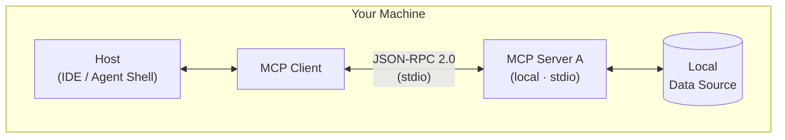
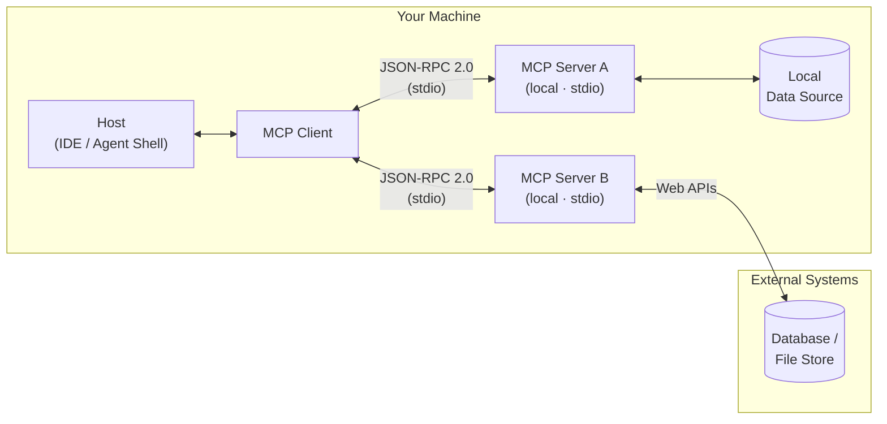
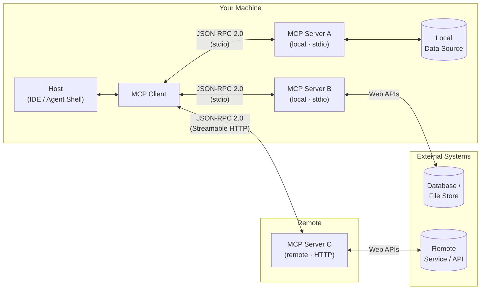
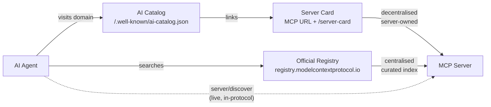

---
layout: cover
obsScene: Scene2
---

# Behind the Scenes: MCP

The Director Between AI and Enterprise Data

<!--
- Kurz die Energie des Event-Themas aufgreifen: Heute sind wir alle Stars – und **StarAgent** managed die Tour.
- Erwartung setzen: kein reiner Theorie-Vortrag. Am Ende läuft ein echter MCP-Server live.
- Ziel benennen: Jede Person hier soll danach erklären können, wie Host, Client und Server bei MCP zusammenspielen – und wissen, wie sie selbst einen Server bauen kann.
-->

---
layout: section
hideInToc: true
---

# Denis Sowa

Architect, AI-Ambassador<br/>
BL Microsoft, Hannover

---
layout: agenda
hideInToc: true
transition: slide-up
---

# _Today's Setlist_

<Toc :columns="2" :maxDepth="1" />

<!--
- Die Präsentation gliedert sich in vier Teile:
  - Warum "MCP" und was es ist
  - Architektur und Capabilities
  - Wir implementieren "MCP" – mit Demo
  - Ausblick
-->

---
section: { title: "Why MCP Matters", duration: 5m }
obsScene: Scene5
obsSceneDelay: 5s
---

# Why MCP Matters

### The world before MCP

| Problem                                   | Reality                        |
|-------------------------------------------|--------------------------------|
| Every AI integration was custom-built     | Glue code everywhere           |
| Connectors not portable across hosts      | Rewrite for each AI app        |
| No standard for security or lifecycle     | Every team reinvents the wheel |
| Maintenance cost grew with each new model | Fragile, tightly coupled       |

> MCP standardizes the contract between AI and the outside world.

<!--
- Pain Points aus dem eigenen Umfeld nennen: Wer hat schon mal einen eigenen Connector für ein LLM gebaut?
- Analogie: Vor USB gab es für jedes Gerät einen anderen Stecker. MCP ist der USB-Standard für AI-Integrationen.
- Herkunft: MCP wurde von **Anthropic** entwickelt und im **November 2024** als offener Standard veröffentlicht. Seitdem wird es von Microsoft, GitHub, Google und zahlreichen anderen Unternehmen aktiv unterstützt und weiterentwickelt.
- Governance: Seit **Dezember 2025** liegt MCP herstellerneutral bei der **Agentic AI Foundation** unter dem Dach der Linux Foundation.
- Kernbotschaft: MCP ist kein Framework, kein Produkt – es ist ein offenes Protokoll, das den Vertrag zwischen AI-Host und externer Fähigkeit definiert.
-->

---
hideInToc: true
obsScene: Scene2
obsSceneDelay: 30s
---

# Why Not Just OpenAPI?

### OpenAPI describes the API – MCP standardizes how a host offers it to a model

|                    | OpenAPI / REST                                  | MCP                                                    |
|--------------------|-------------------------------------------------|--------------------------------------------------------|
| **Executes calls** | Every host builds its own glue                  | Standard MCP client in every host                      |
| **Authentication** | Spec says _what_, not _who holds the key_       | Host handles OAuth – the token never reaches the model |
| **Granularity**    | All endpoints, the model orchestrates the calls | Few task-level tools, logic stays in the server        |
| **Context**        | Whole spec in the prompt                        | Curated tool list                                      |
| **Portability**    | Import per host / framework                     | One server, every host                                 |
| **Interaction**    | Request / response only                         | Elicitation · MCP Apps · Tasks · notifications         |
| **Local access**   | Needs an HTTP endpoint                          | `stdio`: files, IDE, local databases                   |

> Small, clean API and plain request/response? OpenAPI as a tool source is fine.
> Several hosts, user authentication or interaction? That's where MCP pays off.

<!--
- Häufige Frage aufgreifen: „Ich gebe dem Modell doch einfach die Swagger-Datei – dann kann es die REST-API genauso nutzen?“
- Ehrlich einordnen: Für eine kleine, sauber beschriebene API funktioniert das gut. Viele Frameworks machen aus OpenAPI direkt Tools; es gibt sogar Generatoren, die aus einer OpenAPI-Spec einen MCP-Server bauen.
- Der Unterschied liegt nicht darin, ob das Modell die API versteht, sondern in allem drumherum:
  - Wer führt den Aufruf aus, fängt Fehler ab, gibt Ergebnisse zurück? Ohne MCP baut das jeder Host selbst. (Die Rollen Host, Client und Server kommen gleich bei der Architektur.)
  - Anmeldung: Die Spec sagt, dass es OAuth gibt – aber nicht, wer den Token besorgt. Bei MCP übernimmt das der Host, der Token landet nie im Kontext des Modells.
  - Große APIs: 200 Endpunkte im Kontext, das Modell muss die Aufruffolge selbst zusammensetzen. MCP-Server bieten wenige, aufgabenbezogene Tools – z. B. `book_venue` statt fünf REST-Calls.
  - Was REST nicht ausdrücken kann: Rückfrage beim User mitten im Call (Elicitation), UI im Chat (MCP Apps), lange Vorgänge (Tasks), Benachrichtigungen.
- Kernsatz: MCP ersetzt REST nicht – ein MCP-Server kapselt oft genau so eine REST-API. REST ist die Schnittstelle für Programme, MCP die Schnittstelle für Modelle.
-->

---
transition: slide-up
---

# Useful MCP Servers

| Server                | What it exposes                                |
|-----------------------|------------------------------------------------|
| **Context7**          | Up-to-date library docs and code examples      |
| **Microsoft Learn**   | Official Microsoft / Azure documentation       |
| **Azure DevOps**      | Work items, pipelines, repos, boards           |
| **GitHub**            | Repos, issues, pull requests, code search      |
| **Jira / Confluence** | Tickets, pages, project data                   |
| **Azure**             | Azure resources, subscriptions, deployments    |
| **Playwright**        | Browser automation and web scraping            |
| **Chrome DevTools**   | Live browser inspection, console, network, DOM |

<!--
- Hinweis: Die Verzeichnis-URLs sind später auf der Folie "Where to go next" aufgeführt.
- **Überleitung:** was genau ist dieses Protokoll?
-->

---
section: { title: Architecture, duration: 4m }
---

# What Is MCP

### Model Context Protocol

- **Wire protocol:** JSON-RPC 2.0 – both sides speak structured text
- **Capability model:** Tools · Resources · Resource Links · Prompts · Elicitation · Structured Output · OAuth 2.1 ·
  Streamable HTTP
- **Extensions:** Tasks · MCP Apps · Server Cards – optional, versioned independently of the core
- **Stateless request/response:** no handshake, no sessions – every request carries version and capabilities
- **Interoperability:** one server works with any MCP-compatible host
- **Transports:** `stdio` for local processes · `Streamable HTTP` for remote services

> An open standard that defines how AI applications securely and structurally connect to tools and data sources.

<!--
- MCP als Protokoll einordnen, nicht als Bibliothek oder Framework.
- JSON-RPC 2.0 hervorheben: Der MCP Client (im Host) und der Server tauschen schlicht strukturierten Text aus.
- Capabilities - dazu gleich mehr.
- Spec-Stand **2026-07-28** – größte Revision seit dem Launch: MCP ist jetzt stateless. Kein `initialize`-Handshake, keine Sessions mehr; jeder Request bringt Protokollversion und Client-Capabilities in `_meta` mit. Dadurch kann jeder Request auf jeder Server-Instanz hinter einem Load Balancer landen.
- Extensions-Framework: Tasks, MCP Apps und Server Cards sind offizielle, optionale Extensions – nicht Teil des Core-Protokolls.
- Transport kurz erwähnen: lokal läuft es über stdio (Standard-Ein-/Ausgabe), remote über HTTP. Details kommen im Architektur-Diagramm.
- Interoperabilität betonen: ein MCP-Server in .NET funktioniert mit GitHub Copilot, Claude Desktop, VS Code und jedem anderen MCP-Host.
-->

---
transition: fade
obsScene: Scene5
---

# MCP Architecture



<!--
- Die drei Rollen klar abgrenzen:
  - Host = AI-App
  - Client = Protokollschicht im Host
  - Server = Fähigkeiten-Anbieter
- Wichtiger Punkt: Host und Server können unabhängig voneinander entwickelt werden – das ist die Stärke des Standards.
- Der Host kann mehrere Clients gleichzeitig nutzen.
- Diagramm erläutern: lokal über stdio (einfach, schnell, für Entwicklung). Remote-Server kommen zwei Folien weiter.
- Beispiel aus der Praxis: VS Code mit GitHub Copilot ist der Host + Client. Unser StarAgent-Server ist der MCP Server.
-->

---
transition: fade
hideInToc: true
---

# Architecture: Multiple Servers



<!--
- Die drei Rollen klar abgrenzen:
  - Host = AI-App
  - Client = Protokollschicht im Host
  - Server = Fähigkeiten-Anbieter
- Wichtiger Punkt: Host und Server können unabhängig voneinander entwickelt werden – das ist die Stärke des Standards.
- Der Host kann mehrere Clients gleichzeitig nutzen.
- Diagramm erläutern: Ein Client spricht mit mehreren lokalen Servern über stdio; ein Server kann selbst externe Systeme über Web APIs anbinden.
- Beispiel aus der Praxis: VS Code mit GitHub Copilot ist der Host + Client. Unser StarAgent-Server ist der MCP Server.
-->

---
hideInToc: true
---

# Architecture: Local + Remote



<!--
- Die drei Rollen klar abgrenzen:
  - Host = AI-App
  - MCP Client = Protokollschicht im Host
  - MCP Server = Fähigkeiten-Anbieter
- Wichtiger Punkt: Host und Server können unabhängig voneinander entwickelt werden – das ist die Stärke des Standards.
- Der Host kann mehrere Clients gleichzeitig nutzen.
- Diagramm erläutern: lokal über stdio (einfach, schnell, für Entwicklung), remote über HTTP (produktionstauglich, skalierbar).
- Beispiel aus der Praxis: VS Code mit GitHub Copilot ist der Host + Client. Unser StarAgent-Server ist der MCP Server.
-->

---
hideInToc: true
transition: slide-up
obsScene: Scene2
---

# Architecture: Roles

### Three roles – clear responsibilities

- **Host:** the AI application (IDE, agent shell, chat client)
    - Manages the LLM conversation
    - Decides which capabilities the model may use
    - Runs the tool calls the model proposes – after policy check or user approval
- **MCP Client:** protocol connector embedded in the host
    - Speaks MCP to one or more servers
    - Translates server capabilities into LLM-usable function definitions
- **MCP Server:** exposes capabilities and wraps external systems
    - Implements Tools, Resources, and/or Prompts
    - Completely independent of host and model

<!--
- Die drei Rollen klar abgrenzen:
  - Host = AI-App
  - Client = Protokollschicht im Host
  - Server = Fähigkeiten-Anbieter
- Ablauf eines Tool-Calls in einem Satz: Der Host schickt die User-Frage plus Tool-Definitionen ans LLM, das LLM schlägt einen Tool-Call vor, der Host prüft und lässt ihn ggf. vom User freigeben, der Client ruft `tools/call` beim Server auf, das Ergebnis geht als neuer Kontext zurück ans LLM.
- Kernpunkt: Das LLM ruft nie selbst etwas auf – es schlägt vor, der Host entscheidet und führt aus.
-->

---
section: { title: Capabilities, duration: 3m }
obsScene: Scene5
obsSceneDelay: 10s
---

# Capabilities

- **Tool** → the model needs to _do_ something or fetch dynamic data
- **Resource** → stable, readable document or data set (like a file or config)
- **Resource Links** → references that point to resources without embedding their content
- **Prompt** → standardized, repeatable workflow the model should follow
- **Elicitation** → the server needs structured input from the user during a flow (via multi round-trip requests)
- **Structured Output** → tool results must conform to a defined schema
- **OAuth 2.1** → the server requires authenticated access to protected resources
- **Streamable HTTP** → the server runs remotely – stateless, scales behind a load balancer
- **Tasks** _(extension)_ → long-running or background operations that outlive a single request
- **MCP Apps** _(extension)_ → interactive UI rendered by the host (forms, dashboards, visualizations)
- ~~**Sampling**~~ _(deprecated)_ → call the LLM provider API directly instead

<!--
- Das ist eine kompakte Übersicht aktueller MCP-Primitives, Features und Extensions: Stand Oktober 2026, Spec 2026-07-28.
- Deprecated seit 2026-07-28: **Sampling**, **Roots** und **Logging**. Sie funktionieren noch während der Deprecation-Phase (mind. 12 Monate), neue Implementierungen sollen sie aber nicht mehr nutzen. Ersatz: LLM-Provider direkt anbinden statt Sampling; Verzeichnisse als Tool-Parameter oder Konfiguration statt Roots; stderr bzw. OpenTelemetry statt Logging.
- Governance-Hinweis: Die Typen haben unterschiedliche Risikoprofile (Seiteneffekte, read-only, usw.)
-->

---
hideInToc: true
---

# MCP Feature Support Matrix

| Feature           | Spec Status                         | Client Reality                     |
|-------------------|-------------------------------------|------------------------------------|
| Tool              | ✅ Stable                           | High                               |
| Resource          | ✅ Stable                           | Medium                             |
| Resource Links    | ✅ Stable (since 06/2025)           | Low                                |
| Prompt            | ✅ Stable                           | Medium                             |
| Structured Output | ✅ Stable (since 06/2025)           | Medium                             |
| OAuth 2.1         | ✅ Stable (hardened 07/2026)        | Medium                             |
| Streamable HTTP   | ✅ Stable (stateless since 07/2026) | High                               |
| Elicitation       | ✅ Stable (via MRTR since 07/2026)  | Medium                             |
| Tasks             | 🧩 Official extension (07/2026)     | Low                                |
| MCP Apps          | 🧩 Official extension (01/2026)     | Claude · ChatGPT · VS Code · Goose |
| Server Cards      | 🧩 Official extension (SEP-2127)    | Low                                |
| Sampling          | ⚠️ Deprecated (07/2026)             | Low                                |
| Roots · Logging   | ⚠️ Deprecated (07/2026)             | Medium (Roots)                     |

<!--
- Inzwischen wie HTML/CSS (vgl. caniuse): Quelle für Client Reality ist https://github.com/apify/mcp-client-capabilities – 43 Clients, Stand 09/2026.
- Ausgezählt: Tools 72 % (in der Praxis eher ~100 %, einige Einträge sind unvollständig), Resources 30 %, Elicitation 30 %, Prompts 26 %, Roots 26 %, Sampling 19 %, Tasks 5 %.
- Einstufung: High ≥ 50 %, Medium 20–49 %, Low < 20 %. Werte sind ungewichtet (ein Nischen-Client zählt wie ChatGPT); die meisten Einträge melden noch Protokoll 2025-06-18.
- Resource Links, Structured Output, OAuth, Streamable HTTP und Server Cards werden dort nicht erfasst – Einschätzung. Transport/Auth im Detail: https://zuplo.com/learn/mcp/compatibility
- Spec-Stand 2026-07-28. Extensions sind optional und werden unabhängig vom Core versioniert.
- Deprecated heißt: funktioniert noch, wird aber nach einer Übergangsfrist (mind. 12 Monate) entfernt.
-->

---
hideInToc: true
transition: slide-up
---

# Demo Capabilities

### A server primitive – plus a UI extension

| Capability  | Kind                                     | StarAgent example                                                                  |
|-------------|------------------------------------------|------------------------------------------------------------------------------------|
| **Tool**    | Server primitive                         | `get_chart_position` and `book_venue` – executable operations                      |
| **MCP App** | Extension (`io.modelcontextprotocol/ui`) | `ui://staragent/chart-card.html` – interactive chart card for `get_chart_position` |

<!--
- Die Semantik präzise machen:
  - Tool = execute, registrierbares Primitive, kann Seiteneffekte haben.
  - MCP App = UI zu einem Tool: Der Server liefert eine `ui://`-Resource (HTML), der Host rendert sie in einer Sandbox im Chat.
- `book_venue` fragt fehlende Buchungsdaten per Elicitation nach – seit Spec 2026-07-28 als Multi Round-Trip Request (`resultType: "input_required"`, der Client wiederholt den Call mit `inputResponses`).
- Die Chart Card ruft `get_chart_position` selbst wieder auf, wenn man den Chart wechselt – ohne Umweg über das LLM.
- Die übrigen Capabilities (Resources, Prompts, …) standen in der Übersicht vorher – in der Demo zeigen wir Tools und MCP Apps.
-->

---
layout: section
section: { title: Implementation, duration: 9m }
obsScene: Scene5
---

# Implementation

---
obsScene: Scene2
obsSceneDelay: 15s
---

# .NET SDK

### Getting started

**Option A: Project template (recommended for new projects)**

```shell
dotnet new install Microsoft.McpServer.ProjectTemplates
dotnet new mcpserver -n StarAgent.McpServer
```

**Option B: Visual Studio**

- New Project → search for "MCP" → select the MCP Server template

**Option C: Add to an existing project**

```shell
dotnet add package ModelContextProtocol
```

<!--
- SDK einordnen: War lange ein Preview-Paket. Seit 28.07.2026 Version 2 (aktuell 2.2.0, August 2026) – passend zur Spec 2026-07-28.
- v2 ist abwärtskompatibel: v1-Code kompiliert weiter, Client und Server sprechen auch mit älteren Gegenstellen.
- Optionale Extensions als eigene Pakete: `ModelContextProtocol.Extensions.Tasks` und `ModelContextProtocol.Extensions.Apps` (noch experimentell).
- **Überleitung:** Genug geredet, wir erstellen das StarAgent Projekt.
-->

---
title: "Create Project"
layout: blank
variant: dark
class: blank--fullscreen
footer: false
---

<Asciinema src="assets/casts/createproject.cast"/>

---
layout: blank
transition: none
title: "Program.cs"
---

> // Program.cs
> <<< @/snippets/Program.cs

<!--
- Program.cs zeigen und auf den nächsten Folien erklären.
-->

---
layout: blank
transition: none
hideInToc: true
title: "Program.cs – Usings & Builder"
---

> // Program.cs
> <<< @/snippets/Program.cs {1-5}

---
layout: blank
transition: none
hideInToc: true
title: "Program.cs – Logging to stderr"
---

> // Program.cs
> <<< @/snippets/Program.cs {7-8}

<!--
- Logging-Hinweis: Bei stdio läuft die Protokollkommunikation über stdout. Logging immer auf stderr oder in eine Datei umleiten, damit keine Lognachrichten das Protokoll stören.
-->

---
layout: blank
transition: none
hideInToc: true
title: "Program.cs – MCP Services"
---

> // Program.cs
> <<< @/snippets/Program.cs {10-11}

---
layout: blank
transition: none
hideInToc: true
title: "Program.cs – AddMcpServer ()"
---

> // Program.cs
> <<< @/snippets/Program.cs {12}

<!--
- Erledigt DI
-->

---
layout: blank
transition: none
hideInToc: true
title: "Program.cs – stdio Transport"
---

> // Program.cs
> <<< @/snippets/Program.cs {13}

<!--
- Hier mit Stdio.
-->

---
layout: blank
transition: none
hideInToc: true
title: "Program.cs – Register Capabilities"
---

> // Program.cs
> <<< @/snippets/Program.cs {14-16}

<!--
- `WithToolsFromAssembly()` / `WithResourcesFromAssembly()` / `WithPromptsFromAssembly()` – alle Klassen mit den entsprechenden Attributen im Assembly werden automatisch registriert.
- `.WithToolsFromAssembly(typeof(ChartTools).Assembly)`
- `.WithTools<Tool>()` – nur eine bestimmte Klasse registrieren.
-->

---
layout: blank
hideInToc: true
title: "Program.cs – Build & Run"
---

> // Program.cs
> <<< @/snippets/Program.cs {18}

<!--
- **Überleitung:** Was implementieren wir in der Demo
-->

---
hideInToc: true
layout: blank
variant: dark
class: blank--fullscreen
footer: false
title: "Project Structure"
---

<Asciinema src="assets/casts/projectstructure.cast"/>

<!--
- Kurz die Magie der Demo erklären: Ich habe da schonmal was vorbereitet…
- **Überleitung:** Schauen wir uns die Projektstruktur an – die Tool-Klasse `ChartTools` ist noch leer, wir füllen sie gleich live.
-->

---
layout: blank
showFor: live
title: "ChartTools.cs"
obsScene: Scene5
obsSceneDelay: 10s
---

> // ChartTools.cs

<MonacoSync />

```csharp {monaco}  {height:'460px'}
using ModelContextProtocol.Server;
using StarAgent.McpServer.Shared.Models;
using StarAgent.McpServer.Shared.Services;
using System.ComponentModel;

public static class ChartTools
{
    public static ChartResult GetChartPosition(
        string songTitle,
        string artist,
        string chart = "Billboard Hot 100")
    {
        return ChartDataService.Lookup(songTitle, artist, chart);
    }
}

```

<!--
```
    [McpServerToolType]

    [McpServerTool(Name = "get_chart_position")]
    [Description("Returns the chart position of a song on a given chart.")]
    public static ChartResult GetChartPosition(
        [Description("Song title")] string songTitle,
        [Description("Artist name")] string artist,
        [Description("Chart name")] string chart = "Billboard Hot 100")
    {
        return ChartDataService.Lookup(songTitle, artist, chart);
    }
```

- Attribute-Ansatz betonen: Wer .NET kennt, fühlt sich sofort zu Hause. Kein Boilerplate, kein manuelles JSON-Parsing.
- Description-Attribute sind entscheidend: Sie landen direkt im Tool-Schema, das das LLM sieht. Je klarer die Description, desto besser die Tool-Auswahl durch das Modell.
-->

---
layout: blank
title: "ChartTools.cs"
obsScene: Scene5
---

> // ChartTools.cs

<CodeBlockSync />
<<< @/snippets/ChartTools.cs {maxHeight: '440px'}

---
layout: blank
title: "MCP Apps: Chart Card"
obsScene: Scene2
obsSceneDelay: 10s
---

# MCP Apps: Chart Card

### One attribute turns a tool result into an interactive UI

```csharp
// ChartTools.cs – link the tool to a UI resource
[McpServerTool(Name = "get_chart_position", UseStructuredContent = true)]
[McpAppUi(ResourceUri = "ui://staragent/chart-card.html")]
public static ChartResult GetChartPosition(...)

// ChartCardApp.cs – the UI is just another resource: one HTML file, inline JS + SVG
[McpServerResource(UriTemplate = "ui://staragent/chart-card.html", MimeType = McpApps.HtmlMimeType)]
public static string GetChartCard() => LoadHtml();

// Program.cs
builder.Services.AddMcpServer()
       // ...
       .WithMcpApps();
```

<!--
- Paket: `ModelContextProtocol.Extensions.Apps` – noch als experimentell markiert (Warnung MCPEXP003).
- `[McpAppUi]` setzt `_meta.ui.resourceUri` am Tool. Der Host lädt die `ui://`-Resource (MIME-Type `text/html;profile=mcp-app`) und rendert sie in einem sandboxed iframe.
- `UseStructuredContent = true`: Das Ergebnis kommt als `structuredContent` – die UI rendert daraus, das LLM bekommt weiterhin den Text.
- Nach dem Laden läuft die Kommunikation ganz „normal“ per JSON-RPC 2.0 – nur über `window.parent.postMessage` (senden) und `window.addEventListener("message", …)` (empfangen) statt über stdio oder HTTP:
  - App → Host: `ui/initialize`, dann `ui/notifications/initialized`; `tools/call` für frische Daten.
  - Host → App: Tool-Ergebnis als `ui/notifications/tool-result`, Theme-Wechsel als `ui/notifications/host-context-changed`.
  - Die Chart Card nutzt dafür das offizielle SDK `@modelcontextprotocol/ext-apps` (Klasse `App`: `connect()`, `callServerTool()`, `ontoolresult`, …; auch mit React-Hooks). Der Server baut es beim Ausliefern direkt ins HTML ein – kein CDN, keine CSP-Freigabe nötig.
- Die App spricht nie direkt mit Server oder LLM, nur mit dem Host. `ui/…`-Methoden bleiben zwischen App und Host, MCP-Methoden wie `tools/call` reicht der Host an den Server weiter.
- Was das LLM sieht: nichts vom iframe. Ergebnisse von `tools/call` aus der App bleiben in der UI. Ins Modell kommt nur, was die App ausdrücklich schickt – `ui/update-model-context` (Kontext für den nächsten Turn) oder `ui/message` (Nachricht in den Chat, löst sofort eine Antwort aus).
- Fallback: Hosts ohne MCP Apps (z.B. Claude Code) zeigen einfach das JSON. Ein Server, jeder Host.
-->

---
title: Register MCP
transition: slide-up
---

# Register: stdio

### Development with stdio transport

```json
{
    "servers": {
        "StarAgent": {
            "type": "stdio",
            "command": "dotnet",
            "args": [
                "run",
                "--project",
                "<path-to-project>"
            ]
        }
    }
}
```

<!--
- Jetzt den MCP in der Konfiguration hinzufügen.
-->

---
layout: section
section: { title: Demo, duration: 7m }
obsScene: Scene5
---

# Demo

<!--
- **Überleitung:** Wir nutzen den MCP-Server.
- Claude erkennt MCP automatisch
-->

---
layout: blank
variant: dark
class: blank--fullscreen
footer: false
hideInToc: true
title: "Demo: Tools"
obsScene: Scene2
obsSceneDelay: 50s
---

<Asciinema src="assets/casts/mcp_tools.cast" />

<!--
- Wo steht Bohemian Rhapsody von Queen in den Charts? - Natürlich auf der #1!
- Eine Halle buchen:
    - Nur Queen und 5000 Personen angeben
    - MCP fragt nach den fehlenden Parametern (Elicitation)
      - Seit Spec 2026-07-28 als Multi Round-Trip Request: Der Server antwortet mit `input_required`, der Host fragt den User und wiederholt den Tool-Call mit den Antworten. Funktioniert damit auch über stateless HTTP.
    - Der Host rendert eine passende UI (sieht jedes Mal anders aus)
-->

---
layout: blank
variant: dark
class: blank--fullscreen
footer: false
hideInToc: true
title: "Demo: MCP Apps"
obsScene: Scene5
---

<SlidevVideo autoplay autoreset="slide" poster="/assets/ChartCard.png">
  <source :src="'/assets/mcp-app.mp4'" type="video/mp4" />
</SlidevVideo>

<!--
- Host: **Claude Desktop** – Claude Code (Terminal) rendert keine MCP Apps. Derselbe stdio-Server, nur ein anderer Host.
- Aufgezeichnetes Video (ca. 30 s), startet automatisch mit der Folie.
- Im Video: Frage „Wo steht Bohemian Rhapsody von Queen in den Charts?“ → statt JSON erscheint die Chart Card im Chat.
- Highlight im Video: Das Dropdown wird auf „Offizielle Deutsche Charts“ umgestellt. Die UI ruft `get_chart_position` **selbst** auf (`tools/call` über den Host) – ganz ohne LLM-Runde. Ergebnis: #2.
- Botschaft: Daten fließen in beide Richtungen – die App ist kein Bild, sondern ein kleiner MCP-Client im Chat.
- Unterstützte Hosts: Claude (Web/Desktop), VS Code GitHub Copilot, M365 Copilot, ChatGPT, Cursor, Goose, …
-->

---

# Debugging Tip

> npx @modelcontextprotocol/inspector


<!--
- Features:
    - Resources
    - Prompts
    - Tools
- Neu:
    - Tasks
    - Apps
    - Usw.
-->

---
section: { title: "Deployment Options", duration: 3m }
---

# HTTP Transport: Reference

### From stdio to Streamable HTTP – minimal changes

```shell
dotnet add package ModelContextProtocol.AspNetCore
```

> // Program.cs

```csharp {monaco-diff}  {height:'280px'}
var builder = Host.CreateApplicationBuilder(args);

builder.Services
    .AddMcpServer()
    .WithStdioServerTransport()
    .WithToolsFromAssembly()
    .WithResourcesFromAssembly()
    .WithPromptsFromAssembly();

var app = builder.Build();
await app.RunAsync();
~~~
var builder = WebApplication.CreateBuilder(args);

builder.Services
    .AddMcpServer()
    .WithHttpTransport()
    .WithToolsFromAssembly()
    .WithResourcesFromAssembly()
    .WithPromptsFromAssembly();

var app = builder.Build();
app.MapMcp("/mcp");
await app.RunAsync("http://localhost:3001");
```

<!--
- Folie ist reine Referenz – kein Live-Coding hier.
- Hauptaussage: Die Tool-/Resource-/Prompt-Implementierungen bleiben 1:1 identisch. Nur `Program.cs` ändert sich.
- SDK v2: `WithHttpTransport()` ist jetzt **standardmäßig stateless** – passend zur Spec 2026-07-28 ohne Sessions. Jede Instanz kann jeden Request bedienen, kein Sticky Routing nötig. Wer Zustand braucht, gibt explizite IDs als Tool-Parameter zurück. Stateful nur noch per `Stateless = false` (erzeugt Warnungen).
- Auth-Hinweis: Bei HTTP-Transport ist Authentifizierung Pflicht in Produktion. Typisch: Microsoft Entra ID, API-Keys oder OAuth. Neu in der Spec: Client ID Metadata Documents statt Dynamic Client Registration, plus Issuer-Prüfung nach RFC 9207.
-->

---
hideInToc: true
obsScene: Scene2
---

# Register: HTTP

### Development with HTTP transport

**Connect a host via `mcp.json`**

```json
{
    "servers": {
        "StarAgent": {
            "type": "http",
            "url": "http://localhost:3001/mcp"
        }
    }
}
```

---

# Azure Function: Reference

### Serverless hosting

> // Program.cs

```csharp
using Microsoft.Azure.Functions.Worker;
using Microsoft.Azure.Functions.Worker.Builder;
using Microsoft.Extensions.DependencyInjection;
using Microsoft.Extensions.Hosting;

FunctionsApplicationBuilder builder = FunctionsApplication.CreateBuilder(args);

builder.ConfigureFunctionsWebApplication();

builder.Services
       .AddApplicationInsightsTelemetryWorkerService()
       .ConfigureFunctionsApplicationInsights();

await builder.Build().RunAsync();

```

<!--
- Diese Folie zeigt den Azure-Functions-Host-Wrapper; die MCP-Anbindung übernimmt die **Azure Functions MCP Extension** (inzwischen GA).
- Azure Functions isolated worker ist das moderne Modell (.NET 8 / .NET 10) – die MCP Extension unterstützt für C# nur isolated worker.
- Die Extension bietet Trigger für Tools, Resources und Prompts, unterstützt MCP Apps und hat eingebaute MCP-Authentifizierung mit Microsoft Entra ID.
- Tool-Properties lassen sich alternativ in `Program.cs` per `builder.ConfigureMcpTool("...").WithProperty(...)` definieren.
- Stateless-Hinweis: Functions passen gut zum neuen stateless MCP. Die Umsetzung von Spec 2026-07-28 (SEP-2575) und Tasks steht bei der Extension noch auf der Roadmap.
- Produktionsrelevanz: Viele Enterprise-Teams, die bereits Functions nutzen, können so MCP-Fähigkeiten mit minimaler Infrastruktur exposieren.
- Auth: Function-Keys für einfache Szenarien, Microsoft Entra ID für Unternehmensumgebungen.
-->

---
hideInToc: true
transition: slide-up
---

# Azure Function

> // McpToolFunctions.cs

```csharp
[Function(nameof(GetChartPosition))]
public ChartResult GetChartPosition([McpToolTrigger("get_chart_position", "Returns the chart position of a song on a given chart.")] ToolInvocationContext context,
                                    [McpToolProperty("songTitle", "Song title", true)] string songTitle,
                                    [McpToolProperty("artist", "Artist name", true)] string artist,
                                    [McpToolProperty("chart", "Chart name")] string? chart)
{
    string resolvedChart = string.IsNullOrWhiteSpace(chart)
        ? "Billboard Hot 100"
        : chart;

    return ChartDataService.Lookup(songTitle, artist, resolvedChart);
}
```

---
layout: section
section: { title: Outlook, duration: 6m }
obsScene: Scene5
---

# Outlook

---
hideInToc: true
---

# Auto-Discovery

### Server Cards — SEP-2127 (final, official extension)

```json
{
    "$schema": "https://static.modelcontextprotocol.io/schemas/v1/server-card.schema.json",
    "name": "com.yourdomain/star-agent",
    "title": "StarAgent",
    "version": "1.0.0",
    "description": "AI tour manager for concerts and artists",
    "remotes": [
        {
            "type": "streamable-http",
            "url": "https://yourdomain.com/mcp",
            "supportedProtocolVersions": [
                "2026-07-28"
            ]
        }
    ]
}
```

| Model                 | Where                                    | Purpose                     |
|-----------------------|------------------------------------------|-----------------------------|
| **AI Catalog**        | `/.well-known/ai-catalog.json`           | Domain-level entry point    |
| **Server Card**       | `https://yourdomain.com/mcp/server-card` | Server-owned, pre-connect   |
| **server/discover**   | JSON-RPC call on the MCP endpoint        | Live, in-protocol discovery |
| **Official Registry** | `registry.modelcontextprotocol.io`       | Curated searchable index    |

<!--
- Einordnung: SEP-2127 (Nachfolger von SEP-1649) ist **Final** – als offizielle, optionale Extension, nicht als Teil des Core-Protokolls.
- Wichtig: Die früheren Draft-Pfade `/.well-known/mcp.json` bzw. `/.well-known/mcp/server-card.json` sind überholt.
- Ablauf: Ein Agent besucht eine Domain und liest `/.well-known/ai-catalog.json` – wie `robots.txt`. Der AI Catalog ist protokollneutral und verlinkt (oder enthält) die MCP Server Cards. Die Server Card liegt empfohlen unter der MCP-URL plus `/server-card`.
- Die Card enthält Identität, Endpoints und unterstützte Protokollversionen – aber bewusst **keine** Tools, Resources oder Prompts. Die können je nach User und Konfiguration variieren und werden immer live per `tools/list` usw. abgefragt.
- `server/discover` ist das Gegenstück im Protokoll: Sobald der Endpoint bekannt ist, liefert der Server Versionen, Capabilities und Identität live. Bei Widersprüchen gewinnt `server/discover`.
- Registry-Analogie: Wie ein App Store. Der MCP-Server wird zentral gelistet, damit Clients und Menschen ihn suchen und kuratiert bewerten können. Die Registry ist weiterhin im Preview.
-->

---
hideInToc: true
obsScene: Scene2
---

# Discovery Models



<!--
- Praxishinweis: Server Cards und Registry ergänzen sich. Die Website liefert die autoritative Selbstbeschreibung, die Registry liefert Auffindbarkeit.
- `server/discover` funktioniert erst, wenn der Endpoint bekannt ist – Server Cards und Registry beantworten die Frage davor: „Wo ist überhaupt ein Server?“
-->

---
hideInToc: true
title: "MCP Ecosystem"
---

> https://modelcontextprotocol.io/registry


---
hideInToc: true
---

# Key Takeaways

- **MCP standardizes AI-to-system integration** – one protocol, any host, any model
- **Capabilities & features:** `Tool` · `Resource` · `Prompt` · `Elicitation` · `Structured Output` ·
  `Resource Links` · `OAuth 2.1` · `Streamable HTTP` – plus extensions: `Tasks` · `MCP Apps` · `Server Cards`
- **MCP is stateless now** – no handshake, no sessions; scales like any web API
- **The host is the control layer** – the LLM proposes, the host decides
- **Transport is a deployment decision** – stdio locally, HTTP remotely, Functions serverlessly
- **Auto-discovery is here** – `/.well-known/ai-catalog.json` → server cards, plus central registries
- **UI is here** – MCP Apps in Claude, ChatGPT, VS Code, Goose, …
- **Start small:** one tool · one server · connect to your host

<!--
- Kernbotschaften nochmal kurz zusammenfassen – nicht vorlesen, sondern in eigenen Worten.
- Wichtigste Botschaft für Entwickelnde: Es ist weniger Aufwand als gedacht. Attribute drauf, DI fertig, Server läuft.
- Wichtigste Botschaft für Nichtentwickelnde: MCP schafft eine klare, auditierbare Grenze zwischen dem LLM und euren Systemen. Das ist gut für Governance und Sicherheit.
-->

---
transition: slide-up
hideInToc: true
---

# Where to go next

| Resource                          | Link                                                         |
|-----------------------------------|--------------------------------------------------------------|
| Awesome MCP servers               | `github.com/punkpeye/awesome-mcp-servers`                    |
| Official MCP Registry (preview)   | `modelcontextprotocol.io/registry`                           |
| Community MCP Directory (curated) | `mcp.directory/awesome-mcp-servers`                          |
| MCP specification                 | `modelcontextprotocol.io/specification`                      |
| What's new in 2026-07-28          | `modelcontextprotocol.io/specification/2026-07-28/changelog` |
| .NET SDK quickstart               | `learn.microsoft.com/dotnet/ai/get-started-mcp`              |
| Build a minimal server            | `learn.microsoft.com/dotnet/ai/quickstarts/build-mcp-server` |
| NuGet package                     | `nuget.org/packages/ModelContextProtocol`                    |

<!--
- **Überleitung:** Q&A öffnen.
-->

---
layout: section
hideInToc: true
transition: slide-up
section: { title: "Q&A", duration: 5m, buffer: true }
obsScene: Scene3
---

# Q&A

---
hideInToc: true
title: "Thank you"
layout: end
section: { title: "Bye", duration: 1m }
---

<animated-text text-white :style="{ fontSize: 'calc(88 * var(--pt))' }" text="Thank you!" />


<!--
- Demo-Repo oder Slides-Link zum Nachschlagen kommunizieren.
-->

---
layout: intro
obsScene: Scene1
---
