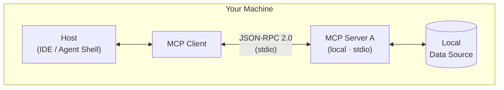
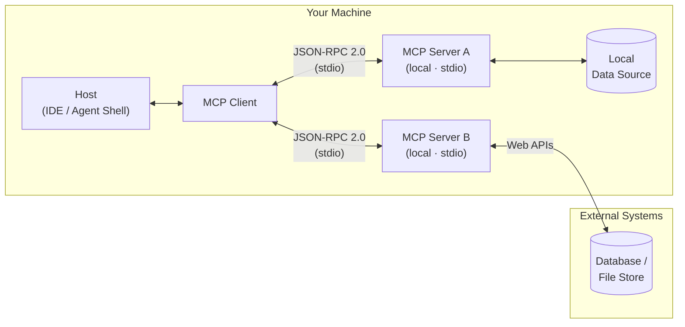
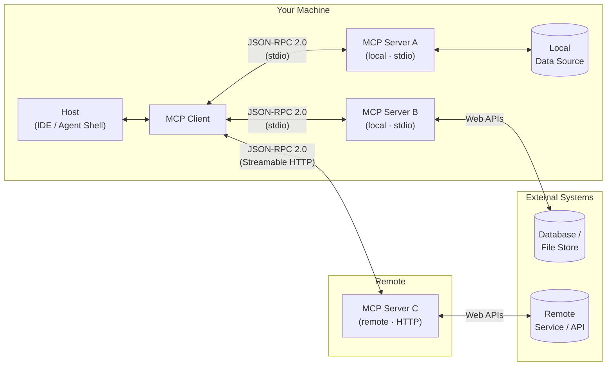
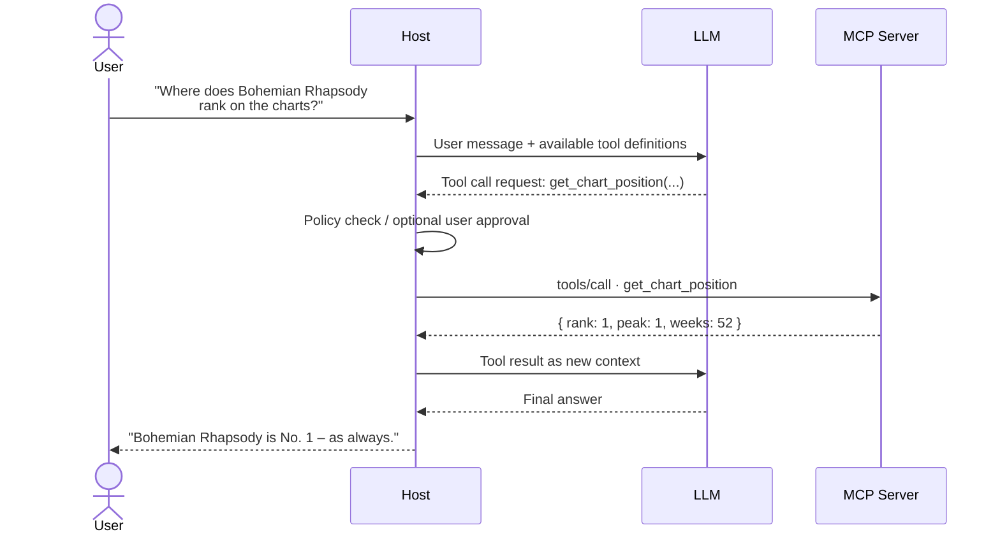
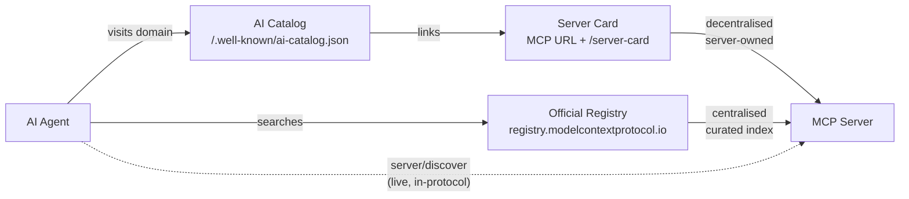

# Behind the Scenes: MCP

The Director Between AI and Enterprise Data

<!--
- Kurz die Energie des Event-Themas aufgreifen: Heute sind wir alle Stars – und **StarAgent** managed die Tour.
- Erwartung setzen: kein reiner Theorie-Vortrag. Am Ende läuft ein echter MCP-Server live.
- Ziel benennen: Jede Person hier soll danach in der Lage sein, den Kommunikationsfluss zwischen LLM und MCP zu erklären – und wissen, wie sie selbst einen Server bauen kann.
-->

---
layout: section
transition: slide-left
hideInToc: true
---

# Denis Sowa

Architect, AI-Ambassador<br/>
BL Microsoft, Hannover

---
layout: agenda
transition: slide-left
hideInToc: true
---

# _Today's Setlist_

<Toc :columns="2" :maxDepth="1" />

<!--
- Die Präsentation gliedert sich in vier Teile:
  - Was ist "MCP"
  - Wie funktioniert "MCP"
  - Wir implementieren "MCP"
  - Ausblick
- Auf GitHub gibt es zusätzliche Folien zur Verteifung.
-->

---
transition: slide-up
section: { title: "Why MCP Matters", duration: 5m }
---

# Why MCP Matters

### The world before MCP

| Problem                                   | Reality                        |
|-------------------------------------------|--------------------------------|
| Every AI integration was custom-built     | Glue code everywhere           |
| Connectors not portable across hosts      | Rewrite for each AI app        |
| No standard for security or lifecycle     | Every team reinvents the wheel |
| Maintenance cost grew with each new model | Fragile, tightly coupled       |

> MCP standardizes the contract between AI and the outside world.

<!--
- Pain Points aus dem eigenen Umfeld nennen: Wer hat schon mal einen eigenen Connector für ein LLM gebaut?
- Analogie: Vor USB gab es für jedes Gerät einen anderen Stecker. MCP ist der USB-Standard für AI-Integrationen.
- Herkunft: MCP wurde von **Anthropic** entwickelt und im **November 2024** als offener Standard veröffentlicht. Seitdem wird es von Microsoft, GitHub, Google und zahlreichen anderen Unternehmen aktiv unterstützt und weiterentwickelt.
- Governance: Seit **Dezember 2025** liegt MCP herstellerneutral bei der **Agentic AI Foundation** unter dem Dach der Linux Foundation.
- Kernbotschaft: MCP ist kein Framework, kein Produkt – es ist ein offenes Protokoll, das den Vertrag zwischen AI-Host und externer Fähigkeit definiert.
-->

---
transition: slide-left
---

# Useful MCP Servers

| Server                | What it exposes                                |
|-----------------------|------------------------------------------------|
| **Context7**          | Up-to-date library docs and code examples      |
| **Microsoft Learn**   | Official Microsoft / Azure documentation       |
| **Azure DevOps**      | Work items, pipelines, repos, boards           |
| **GitHub**            | Repos, issues, pull requests, code search      |
| **Jira / Confluence** | Tickets, pages, project data                   |
| **Azure**             | Azure resources, subscriptions, deployments    |
| **Playwright**        | Browser automation and web scraping            |
| **Chrome DevTools**   | Live browser inspection, console, network, DOM |

<!--
- Hinweis: Die Verzeichnis-URLs sind später auf der Folie "Where to go next" aufgeführt.
- **Überleitung:** was genau ist dieses Protokoll?
-->

---
transition: slide-left
---

# What Is MCP

### Model Context Protocol

- **Wire protocol:** JSON-RPC 2.0 – both sides speak structured text
- **Capability model:** Tools · Resources · Resource Links · Prompts · Elicitation · Structured Output · OAuth 2.1 ·
  Streamable HTTP
- **Extensions:** Tasks · MCP Apps · Server Cards – optional, versioned independently of the core
- **Stateless request/response:** no handshake, no sessions – every request carries version and capabilities
- **Interoperability:** one server works with any MCP-compatible host
- **Transports:** `stdio` for local processes · `Streamable HTTP` for remote services

> An open standard that defines how AI applications securely and structurally connect to tools and data sources.

<!--
- MCP als Protokoll einordnen, nicht als Bibliothek oder Framework.
- JSON-RPC 2.0 hervorheben: Der MCP Client (im Host) und der Server tauschen schlicht strukturierten Text aus – dazu gleich mehr.
- Capabilities - dazu gleich mehr.
- Spec-Stand **2026-07-28** – größte Revision seit dem Launch: MCP ist jetzt stateless. Kein `initialize`-Handshake, keine Sessions mehr; jeder Request bringt Protokollversion und Client-Capabilities in `_meta` mit. Dadurch kann jeder Request auf jeder Server-Instanz hinter einem Load Balancer landen.
- Extensions-Framework: Tasks, MCP Apps und Server Cards sind offizielle, optionale Extensions – nicht Teil des Core-Protokolls.
- Transport kurz erwähnen: lokal läuft es über stdio (Standard-Ein-/Ausgabe), remote über HTTP. Details kommen im Architektur-Diagramm.
- Interoperabilität betonen: ein MCP-Server in .NET funktioniert mit GitHub Copilot, Claude Desktop, VS Code und jedem anderen MCP-Host.
-->

---
transition: fade
section: { title: Architecture, duration: 6m }
---

# MCP Architecture



<!--
- Die drei Rollen klar abgrenzen:
  - Host = AI-App
  - Client = Protokollschicht im Host
  - Server = Fähigkeiten-Anbieter
- Wichtiger Punkt: Host und Server können unabhängig voneinander entwickelt werden – das ist die Stärke des Standards.
- Der Host kann mehrere Clients gleichzeitig nutzen.
- Diagramm erläutern: lokal über stdio (einfach, schnell, für Entwicklung), remote über HTTP (produktionstauglich, skalierbar).
- Beispiel aus der Praxis: VS Code mit GitHub Copilot ist der Host + Client. Unser StarAgent-Server ist der MCP Server.
-->

---
transition: fade
hideInToc: true
---

# Architecture: Multiple Servers



<!--
- Die drei Rollen klar abgrenzen:
  - Host = AI-App
  - Client = Protokollschicht im Host
  - Server = Fähigkeiten-Anbieter
- Wichtiger Punkt: Host und Server können unabhängig voneinander entwickelt werden – das ist die Stärke des Standards.
- Der Host kann mehrere Clients gleichzeitig nutzen.
- Diagramm erläutern: lokal über stdio (einfach, schnell, für Entwicklung), remote über HTTP (produktionstauglich, skalierbar).
- Beispiel aus der Praxis: VS Code mit GitHub Copilot ist der Host + Client. Unser StarAgent-Server ist der MCP Server.
-->

---
transition: slide-up
hideInToc: true
---

# Architecture: Local + Remote



<!--
- Die drei Rollen klar abgrenzen:
  - Host = AI-App
  - MCP Client = Protokollschicht im Host
  - MCP Server = Fähigkeiten-Anbieter
- Wichtiger Punkt: Host und Server können unabhängig voneinander entwickelt werden – das ist die Stärke des Standards.
- Der Host kann mehrere Clients gleichzeitig nutzen.
- Diagramm erläutern: lokal über stdio (einfach, schnell, für Entwicklung), remote über HTTP (produktionstauglich, skalierbar).
- Beispiel aus der Praxis: VS Code mit GitHub Copilot ist der Host + Client. Unser StarAgent-Server ist der MCP Server.
-->

---
transition: slide-left
hideInToc: true
---

# Architecture: Roles

### Three roles – clear responsibilities

- **Host:** the AI application (IDE, agent shell, chat client)
    - Manages the LLM conversation
    - Decides which capabilities the model may use
- **MCP Client:** protocol connector embedded in the host
    - Speaks MCP to one or more servers
    - Translates server capabilities into LLM-usable function definitions
- **MCP Server:** exposes capabilities and wraps external systems
    - Implements Tools, Resources, and/or Prompts
    - Completely independent of host and model

<!--
- Die drei Rollen klar abgrenzen:
  - Host = AI-App
  - Client = Protokollschicht im Host
  - Server = Fähigkeiten-Anbieter
-->

---
transition: slide-up
section: { title: Capabilities, duration: 4m }
---

# Capabilities

### A server primitive – plus a UI extension

| Capability  | Kind                                     | StarAgent example                                                                  |
|-------------|------------------------------------------|------------------------------------------------------------------------------------|
| **Tool**    | Server primitive                         | `get_chart_position` and `book_venue` – executable operations                      |
| **MCP App** | Extension (`io.modelcontextprotocol/ui`) | `ui://staragent/chart-card.html` – interactive chart card for `get_chart_position` |

<!--
- Die Semantik präzise machen:
  - Tool = execute, registrierbares Primitive, kann Seiteneffekte haben.
  - MCP App = UI zu einem Tool: Der Server liefert eine `ui://`-Resource (HTML), der Host rendert sie in einer Sandbox im Chat.
- `book_venue` fragt fehlende Buchungsdaten per Elicitation nach – seit Spec 2026-07-28 als Multi Round-Trip Request (`resultType: "input_required"`, der Client wiederholt den Call mit `inputResponses`).
- Die Chart Card ruft `get_chart_position` selbst wieder auf, wenn man den Chart wechselt – ohne Umweg über das LLM.
- Weitere Capabilities (Resources, Prompts, …) auf der nächsten Folie im Überblick.
-->

---
transition: slide-left
hideInToc: true
---

# Capabilities: Decision Guide

- **Tool** → the model needs to _do_ something or fetch dynamic data
- **Resource** → stable, readable document or data set (like a file or config)
- **Resource Links** → references that point to resources without embedding their content
- **Prompt** → standardized, repeatable workflow the model should follow
- **Elicitation** → the server needs structured input from the user during a flow (via multi round-trip requests)
- **Structured Output** → tool results must conform to a defined schema
- **OAuth 2.1** → the server requires authenticated access to protected resources
- **Streamable HTTP** → the server runs remotely – stateless, scales behind a load balancer
- **Tasks** _(extension)_ → long-running or background operations that outlive a single request
- **MCP Apps** _(extension)_ → interactive UI rendered by the host (forms, dashboards, visualizations)
- ~~**Sampling**~~ _(deprecated)_ → call the LLM provider API directly instead

<!--
- Das ist eine kompakte Übersicht aktueller MCP-Primitives, Features und Extensions: Stand Oktober 2026, Spec 2026-07-28.
- Deprecated seit 2026-07-28: **Sampling**, **Roots** und **Logging**. Sie funktionieren noch während der Deprecation-Phase (mind. 12 Monate), neue Implementierungen sollen sie aber nicht mehr nutzen. Ersatz: LLM-Provider direkt anbinden statt Sampling; Verzeichnisse als Tool-Parameter oder Konfiguration statt Roots; stderr bzw. OpenTelemetry statt Logging.
- Governance-Hinweis: Die Typen haben unterschiedliche Risikoprofile (Seiteneffekte, read-only, usw.)
-->

---
transition: slide-left
hideInToc: true
---

# MCP Feature Support Matrix

| Feature           | Spec Status                         | Client Reality                     |
|-------------------|-------------------------------------|------------------------------------|
| Tool              | ✅ Stable                           | High                               |
| Resource          | ✅ Stable                           | Medium                             |
| Resource Links    | ✅ Stable (since 06/2025)           | Low                                |
| Prompt            | ✅ Stable                           | Medium                             |
| Structured Output | ✅ Stable (since 06/2025)           | Medium                             |
| OAuth 2.1         | ✅ Stable (hardened 07/2026)        | Medium                             |
| Streamable HTTP   | ✅ Stable (stateless since 07/2026) | High                               |
| Elicitation       | ✅ Stable (via MRTR since 07/2026)  | Medium                             |
| Tasks             | 🧩 Official extension (07/2026)     | Low                                |
| MCP Apps          | 🧩 Official extension (01/2026)     | Claude · ChatGPT · VS Code · Goose |
| Server Cards      | 🧩 Official extension (SEP-2127)    | Low                                |
| Sampling          | ⚠️ Deprecated (07/2026)             | Low                                |
| Roots · Logging   | ⚠️ Deprecated (07/2026)             | Medium (Roots)                     |

<!--
- Inzwischen wie HTML/CSS (vgl. caniuse): Quelle für Client Reality ist https://github.com/apify/mcp-client-capabilities – 43 Clients, Stand 09/2026.
- Ausgezählt: Tools 72 % (in der Praxis eher ~100 %, einige Einträge sind unvollständig), Resources 30 %, Elicitation 30 %, Prompts 26 %, Roots 26 %, Sampling 19 %, Tasks 5 %.
- Einstufung: High ≥ 50 %, Medium 20–49 %, Low < 20 %. Werte sind ungewichtet (ein Nischen-Client zählt wie ChatGPT); die meisten Einträge melden noch Protokoll 2025-06-18.
- Resource Links, Structured Output, OAuth, Streamable HTTP und Server Cards werden dort nicht erfasst – Einschätzung. Transport/Auth im Detail: https://zuplo.com/learn/mcp/compatibility
- Spec-Stand 2026-07-28. Extensions sind optional und werden unabhängig vom Core versioniert.
- Deprecated heißt: funktioniert noch, wird aber nach einer Übergangsfrist (mind. 12 Monate) entfernt.
-->

---
transition: slide-up
section: { title: Runtime, duration: 3m }
---

# Runtime: Host as Translator

### The LLM never sees MCP

The **host** is the AI application (Claude Code, Warp, GitHub Copilot, …).
Its embedded **MCP client** speaks two languages: **MCP** on one side, and the **LLM's native tool format** on the
other.

```text
MCP Server (.NET)
    ↕  always: MCP / JSON-RPC 2.0
MCP Client (embedded in host)
    ↕  translated to the LLM's format:
        Claude Code / Warp  →  Anthropic Tool Use  →  injected into system prompt
        GitHub Copilot       →  OpenAI Function Calling
        Gemini               →  Google Function Calling
Host application
    ↕  conversation and policy control
LLM
```

The MCP server never knows which LLM or host application is on the other end.
One server works with every MCP-compatible host – the host handles the translation.

<!--
- Kernbotschaft deutlich machen: LLM und MCP-Server sprechen **nie direkt** miteinander. Der Host ist die AI-App und bleibt die Kontrollinstanz; der eingebettete MCP Client übernimmt die Protokollschicht.
- JSON-RPC 2.0 ist kein Hexenwerk – es sind strukturierte Textnachrichten mit `method`, `params` und `result`.
- Auf Git folgen weitere Folien, mit detalierteren Beschreibungen.
- Dann kommen wir zu: **Wir implementieren "MCP"**
-->

---
transition: slide-left
---

# Lifecycle Calls

### For reference

| Phase                | Call                                                                | Direction                      |
|----------------------|---------------------------------------------------------------------|--------------------------------|
| Discovery (optional) | `server/discover`                                                   | Client → Server                |
| Listing              | `tools/list` · `resources/list` · `prompts/list`                    | Client → Server                |
| Invocation           | `tools/call` · `resources/read` · `prompts/get`                     | Client → Server                |
| Input required       | result `resultType: "input_required"` → retry with `inputResponses` | Server → Client → Server       |
| Change notifications | `subscriptions/listen`                                              | Client opens · Server notifies |

> No handshake, no session: every request carries protocol version and client capabilities in `_meta`.

<!--
- Seit Spec 2026-07-28 gibt es kein `initialize` / `notifications/initialized` mehr, und auch keine `Mcp-Session-Id`.
- `server/discover` liefert unterstützte Protokollversionen, Capabilities und Server-Identität. Jeder Server muss es implementieren, Clients können es optional vorab aufrufen.
- Ältere Server (2025-11-25 und früher) sprechen weiterhin den Handshake. Die SDKs fallen automatisch darauf zurück.
- Multi Round-Trip Requests (MRTR): Braucht der Server weitere Angaben (Elicitation, früher auch Sampling/Roots), antwortet er nicht mit einer eigenen Anfrage an den Client, sondern mit einem Zwischenergebnis `resultType: "input_required"` und `inputRequests`. Der Client holt die Angaben ein und schickt den ursprünglichen Request erneut – mit `inputResponses` und ggf. dem unveränderten `requestState`. Normale Ergebnisse tragen `resultType: "complete"`.
- `subscriptions/listen` ersetzt den HTTP-GET-Stream und `resources/subscribe`: Der Client öffnet einen langlebigen Stream und wählt die Benachrichtigungen aus (`toolsListChanged`, `resourceSubscriptions`, …); der Server schickt darüber die Änderungen.
-->

---
transition: slide-up
hideFor: live
---

# It's just text – structured text

### Step 1 – Host discovers tools from MCP server (JSON-RPC)

```json
{
    "jsonrpc": "2.0",
    "id": 1,
    "result": {
        "resultType": "complete",
        "ttlMs": 300000,
        "cacheScope": "public",
        "tools": [
            {
                "name": "get_chart_position",
                "description": "Returns the chart position of a song.",
                "inputSchema": {
                    "type": "object",
                    "properties": {
                        "songTitle": {
                            "type": "string"
                        },
                        "artist": {
                            "type": "string"
                        },
                        "chart": {
                            "type": "string",
                            "default": "Billboard Hot 100"
                        }
                    },
                    "required": [
                        "songTitle",
                        "artist"
                    ]
                }
            }
        ]
    }
}
```

<!--
- Discovery-Vorgang: Der MCP Client im Host ruft die Fähigkeiten des Servers ab und übersetzt sie in Function-Definitions für das Modell.
- Neu seit 2026-07-28: Jedes Result hat ein `resultType` (`complete` oder `input_required`). List-Ergebnisse sind cachebar: `ttlMs` ist ein Frische-Hinweis, `cacheScope` sagt, ob auch geteilte Caches/Gateways cachen dürfen. Tools sollen in stabiler Reihenfolge kommen – gut für den Prompt-Cache des LLM.
- Highlight: Das LLM „sieht“ nur die Tool-Schemata – es weiß nicht, ob dahinter .NET, Python oder ein Toaster steckt.
-->

---
transition: slide-up
hideFor: live
hideInToc: true
---

# It's just text – structured text

### Step 2 – Host passes tool schema to LLM as a callable function

```json
{
    "type": "function",
    "function": {
        "name": "get_chart_position",
        "description": "Returns the chart position of a song.",
        "parameters": {
            "type": "object",
            "properties": {
                "songTitle": {
                    "type": "string"
                },
                "artist": {
                    "type": "string"
                },
                "chart": {
                    "type": "string"
                }
            },
            "required": [
                "songTitle",
                "artist"
            ]
        }
    }
}
```

<!--
- Highlight: Das LLM „sieht“ nur die Tool-Schemata – es weiß nicht, ob dahinter .NET, Python oder ein Toaster steckt.
-->

---
transition: slide-up
hideFor: live
hideInToc: true
---

# It's just text – structured text

### Step 3 – LLM responds with a tool call

```json
{
    "name": "get_chart_position",
    "arguments": {
        "songTitle": "Bohemian Rhapsody",
        "artist": "Queen"
    }
}
```

<!--
- Das LLM entscheidet, ob es ein Tool aufrufen will – es gibt einfach JSON zurück. Keine Magie.
-->

---
transition: slide-up
hideFor: live
hideInToc: true
---

# It's just text – structured text

### Step 4 – Host sends `tools/call` to MCP server

```json
{
    "jsonrpc": "2.0",
    "id": 2,
    "method": "tools/call",
    "params": {
        "name": "get_chart_position",
        "arguments": {
            "songTitle": "Bohemian Rhapsody",
            "artist": "Queen"
        },
        "_meta": {
            "io.modelcontextprotocol/protocolVersion": "2026-07-28",
            "io.modelcontextprotocol/clientCapabilities": {}
        }
    }
}
```

<!--
- Der Host entscheidet (Policy-Check, ggf. User-Approval); der MCP Client im Host schickt dann `tools/call` an den Server.
- Da es keine Session mehr gibt, trägt jeder Request Protokollversion und Client-Capabilities selbst in `_meta`.
- Bei Streamable HTTP kommen zusätzlich die Header `Mcp-Method: tools/call` und `Mcp-Name: get_chart_position` dazu – Gateways können so routen, ohne den JSON-Body zu parsen.
-->

---
transition: slide-left
hideFor: live
hideInToc: true
---

# It's just text – structured text

### Step 5 – MCP server returns result → host feeds it back to LLM

```json
{
    "jsonrpc": "2.0",
    "id": 2,
    "result": {
        "resultType": "complete",
        "content": [
            {
                "type": "text",
                "text": "{\"rank\":1,\"peak\":1,\"weeks\":52,\"chart\":\"Billboard Hot 100\"}"
            }
        ]
    }
}
```

<!--
- Der Server antwortet dem MCP Client; der Host reicht das Ergebnis als neuen Context an das Modell weiter.
-->

---
transition: slide-up
hideInToc: true
---

# Runtime Sequence

### End-to-end flow



<!--
- Lifecycle-Tabelle nur kurz streifen: Diese Calls gibt es, der Host verwaltet sie automatisch. Man muss sie nicht selbst implementieren – **das SDK erledigt das**.
- Sequenzdiagramm ist das Herzstück: Hier wird sichtbar, dass der Host die Kontrolle behält. Das LLM macht einen Vorschlag (Tool Call), aber der Host entscheidet, ob er ausgeführt wird.
- Wichtige Botschaft: Der Host ist die Sicherheitsinstanz – nicht das LLM.
-->

---
layout: section
transition: slide-left
hideInToc: true
section: { title: Implementation, duration: 12m }
---

# Implementation

---
transition: slide-left
---

# .NET SDK

### Getting started

**Option A: Project template (recommended for new projects)**

```shell
dotnet new install Microsoft.McpServer.ProjectTemplates
dotnet new mcpserver -n StarAgent.McpServer
```

**Option B: Visual Studio**

- New Project → search for "MCP" → select the MCP Server template

**Option C: Add to an existing project**

```shell
dotnet add package ModelContextProtocol
```

<!--
- SDK einordnen: War lange ein Preview-Paket. Seit 28.07.2026 Version 2 (aktuell 2.2.0, August 2026) – passend zur Spec 2026-07-28.
- v2 ist abwärtskompatibel: v1-Code kompiliert weiter, Client und Server sprechen auch mit älteren Gegenstellen.
- Optionale Extensions als eigene Pakete: `ModelContextProtocol.Extensions.Tasks` und `ModelContextProtocol.Extensions.Apps` (noch experimentell).
- **Überleitung:** Genug geredet, wir erstellen das StarAgent Projekt.
-->

---
title: "Create Project"
transition: slide-left
layout: blank
variant: dark
class: blank--center
---

<Asciinema src="assets/casts/createproject.cast"/>

---
layout: blank
transition: none
title: "Program.cs"
---

> // Program.cs
> <<< @/snippets/Program.cs

<!--
- Program.cs zeigen und auf den nächsten Folien erklären.
-->

---
layout: blank
transition: none
hideInToc: true
showFor: live
title: "Program.cs – Usings & Builder"
---

> // Program.cs
> <<< @/snippets/Program.cs {1-5}

---
layout: blank
transition: none
hideInToc: true
showFor: live
title: "Program.cs – Logging to stderr"
---

> // Program.cs
> <<< @/snippets/Program.cs {7-8}

<!--
- Logging-Hinweis: Bei stdio läuft die Protokollkommunikation über stdout. Logging immer auf stderr oder in eine Datei umleiten, damit keine Lognachrichten das Protokoll stören.
-->

---
layout: blank
transition: none
hideInToc: true
showFor: live
title: "Program.cs – MCP Services"
---

> // Program.cs
> <<< @/snippets/Program.cs {10-11}

---
layout: blank
transition: none
hideInToc: true
showFor: live
title: "Program.cs – AddMcpServer ()"
---

> // Program.cs
> <<< @/snippets/Program.cs {12}

<!--
- Erledigt DI
-->

---
layout: blank
transition: none
hideInToc: true
showFor: live
title: "Program.cs – stdio Transport"
---

> // Program.cs
> <<< @/snippets/Program.cs {13}

<!--
- Hier mit Stdio.
-->

---
layout: blank
transition: none
hideInToc: true
showFor: live
title: "Program.cs – Register Capabilities"
---

> // Program.cs
> <<< @/snippets/Program.cs {14-16}

<!--
- `WithToolsFromAssembly()` / `WithResourcesFromAssembly()` / `WithPromptsFromAssembly()` – alle Klassen mit den entsprechenden Attributen im Assembly werden automatisch registriert.
- `.WithToolsFromAssembly(typeof(ChartTools).Assembly)`
- `.WithTools<Tool>()` – nur eine bestimmte Klasse registrieren.
-->

---
layout: blank
transition: slide-left
hideInToc: true
showFor: live
title: "Program.cs – Build & Run"
---

> // Program.cs
> <<< @/snippets/Program.cs {18}

<!--
- **Überleitung:** Was implementieren wir in der Demo
-->

---
layout: blank
transition: none
hideInToc: true
hideFor: live
title: "Program.cs"
---

> // Program.cs
> <<< @/snippets/Program.cs {7-8,12-16}

---
transition: slide-left
title: "Demo Capabilities"
---

### Demo capabilities

- Tool: `get_chart_position, book_venue`
- Resource: `rider://artist/{name}`
- Prompt: `concert_press_release`
- MCP App: `ui://staragent/chart-card.html` – chart card for `get_chart_position`

<!--
- Drei Klassen nacheinander implementieren.
- Punchline: „Bohemian Rhapsody ist #1 – wie immer“ – ist unser Mock-Verhalten für die Demo. Kommt gleich live.
- book_venue nutzt elicitation.
-->

---
hideInToc: true
transition: slide-left
layout: blank
variant: dark
class: blank--center
title: "Project Structure"
---

<Asciinema src="assets/casts/projectstructure.cast"/>

<!--
- Kurz die Magie der Demo erklären: Ich habe da schonmal etwas vorbereitet…
- **Überleitung:** Schauen wir uns die Projektstruktur an – drei Klassen für Tools, Resources und Prompts. Alle sind komplett leer – wir füllen sie gleich live.
-->

---
layout: blank
transition: slide-left
showFor: live
title: "ChartTools.cs"
---

> // ChartTools.cs

<MonacoSync />
```csharp {monaco}  {height:'460px'}
using ModelContextProtocol.Server;
using StarAgent.McpServer.Shared.Models;
using StarAgent.McpServer.Shared.Services;
using System.ComponentModel;

[McpServerToolType]
public static class ChartTools
{

}

```

<!--
```

    [McpServerTool(Name = "get_chart_position")]
    [Description("Returns the chart position of a song on a given chart.")]
    public static ChartResult GetChartPosition(
        [Description("Song title")] string songTitle,
        [Description("Artist name")] string artist,
        [Description("Chart name")] string chart = "Billboard Hot 100")
    {
        return ChartDataService.Lookup(songTitle, artist, chart);
    }

```

- Attribute-Ansatz betonen: Wer .NET kennt, fühlt sich sofort zu Hause. Kein Boilerplate, kein manuelles JSON-Parsing.
- Description-Attribute sind entscheidend: Sie landen direkt im Tool-Schema, das das LLM sieht. Je klarer die Description, desto besser die Tool-Auswahl durch das Modell.
-->

---
layout: blank
transition: slide-left
hideFor: live
title: "ChartTools.cs"
---

> // ChartTools.cs

<CodeBlockSync />
<<< @/snippets/ChartTools.cs {maxHeight: '440px'}

---
layout: blank
transition: slide-left
showFor: live
title: "RiderResources.cs"
---

> // RiderResources.cs

<MonacoSync />
```csharp {monaco}  {height:'460px'}
using ModelContextProtocol.Server;
using StarAgent.McpServer.Shared.Models;
using StarAgent.McpServer.Shared.Services;
using System.ComponentModel;

[McpServerResourceType]
public static class RiderResources
{

}

```

<!--
```
    [McpServerResource(
        UriTemplate = "rider://artist/{name}",
        Name = "artist_rider",
        MimeType = "application/json")]
    [Description("Returns the backstage rider for an artist.")]
    public static string GetRider(
        [Description("Artist slug")] string name)
    {
        return RiderDataService.Load(name);
    }
```

- **Hinweis:** MCP unterstützt Resource Subscriptions, wenn der Server sie anbietet; der Host kann dann über Änderungen benachrichtigt werden. Seit Spec 2026-07-28 läuft das über `subscriptions/listen` statt `resources/subscribe`.
- Inzwischen gibt es auch Resource Links
-->

---
layout: blank
transition: slide-left
hideFor: live
title: "RiderResources.cs"
---

> // RiderResources.cs

<<< @/snippets/RiderResources.cs {maxHeight: '440px'}

---
layout: blank
transition: slide-left
title: "PressReleasePrompts.cs"
---

> // PressReleasePrompts.cs

<CodeBlockSync />
<<< @/snippets/PressReleasePrompts.cs {maxHeight: '440px'}

<!--
- Prompt klar von Tool abgrenzen: Der Prompt wird nicht ausgeführt und hat keine Seiteneffekte.
- Der Server liefert ein wiederverwendbares Prompt-Template als Prompt Messages zurück.
- Der Host ruft den Prompt ab und gibt die resultierenden Messages an das LLM weiter; der MCP-Server ruft das LLM nicht selbst auf.
- StarAgent-Bezug: `concert_press_release` standardisiert die Dramaturgie für die Tour-Ankündigung.
-->

---
title: Register MCP
transition: slide-left
---

# Register: stdio

### Development with stdio transport

```json
{
    "servers": {
        "StarAgent": {
            "type": "stdio",
            "command": "dotnet",
            "args": [
                "run",
                "--project",
                "<path-to-project>"
            ]
        }
    }
}
```

<!--
- Jetzt den MCP in der Konfiguration hinzufügen.
-->

---
layout: section
transition: slide-left
section: { title: Demo, duration: 7m }
---

# Demo

<!--
- **Überleitung:** Wir nutzen den MCP-Server.
- Claude erkennt MCP automatisch
-->

---
transition: slide-left
layout: blank
variant: dark
class: blank--center
hideInToc: true
title: "Demo: Tools"
---

<Asciinema src="assets/casts/mcp_tools.cast" />

<!--
- Wo steht Bohemian Rhapsody von Queen in den Charts? - Natürlich auf der #1!
- Eine Halle buchen:
    - Nur Queen und 5000 Personen angeben
    - MCP fragt nach den fehlenden Parametern (Elicitation)
      - Seit Spec 2026-07-28 als Multi Round-Trip Request: Der Server antwortet mit `input_required`, der Host fragt den User und wiederholt den Tool-Call mit den Antworten. Funktioniert damit auch über stateless HTTP.
    - Der Host rendert eine passenden UI (sieht jedes mal anders aus)
-->

---
transition: slide-left
layout: blank
variant: dark
class: blank--center
hideInToc: true
title: "Demo: Resources"
hide: true
---

<Asciinema src="assets/casts/mcp_resources.cast" />

<!--
- Zeig mir das Backstage-Rider für Van Halen
- Rider-Punchline: Van Halen öffnen → „Absolutely NO brown M&Ms" live im Chat auftauchen lassen. 🤘
-->

---
transition: slide-left
layout: blank
variant: dark
class: blank--center
hideInToc: true
title: "Demo: Prompt"
hide: true
---

<Asciinema src="assets/casts/mcp_prompt.cast" />

<!--
- **Wichtig:** Der Prompt wird vom Host ausgeführt. Das Ergebnis wird dann an das LLM übergeben. 
- /mcp__StarAgent__concert_press_release Queen Metronom_Theater_Oberhausen 26.06.2026 The_show_must_go_on!
    - Claude parst "..." und "..." nicht.
    - https://github.com/anthropics/claude-code/issues/70284
-->

---
transition: slide-left
hideInToc: true
title: "MCP Apps: Chart Card"
---

# MCP Apps: Chart Card

### One attribute turns a tool result into an interactive UI

```csharp
// ChartTools.cs – link the tool to a UI resource
[McpServerTool(Name = "get_chart_position", UseStructuredContent = true)]
[McpAppUi(ResourceUri = "ui://staragent/chart-card.html")]
public static ChartResult GetChartPosition(...)

// ChartCardApp.cs – the UI is just another resource: one HTML file, inline JS + SVG
[McpServerResource(UriTemplate = "ui://staragent/chart-card.html", MimeType = McpApps.HtmlMimeType)]
public static string GetChartCard() => LoadHtml();

// Program.cs
builder.Services.AddMcpServer()
       // ...
       .WithMcpApps();
```

<!--
- Paket: `ModelContextProtocol.Extensions.Apps` – noch als experimentell markiert (Warnung MCPEXP003).
- `[McpAppUi]` setzt `_meta.ui.resourceUri` am Tool. Der Host lädt die `ui://`-Resource (MIME-Type `text/html;profile=mcp-app`) und rendert sie in einem sandboxed iframe.
- `UseStructuredContent = true`: Das Ergebnis kommt als `structuredContent` – die UI rendert daraus, das LLM bekommt weiterhin den Text.
- Die UI spricht per `postMessage` JSON-RPC mit dem Host: `ui/initialize`, dann bekommt sie das Tool-Ergebnis als `ui/notifications/tool-result`.
- Fallback: Hosts ohne MCP Apps (z.B. Claude Code) zeigen einfach das JSON. Ein Server, jeder Host.
-->

---
transition: slide-left
layout: blank
class: blank--center
hideInToc: true
title: "Demo: MCP Apps"
---


<!--
- Host: **Claude Desktop** – Claude Code (Terminal) rendert keine MCP Apps. Derselbe stdio-Server, nur ein anderer Host.
- Frage: „Wo steht Bohemian Rhapsody von Queen in den Charts?“ → statt JSON erscheint die Chart Card im Chat.
- Highlight: Dropdown auf „Offizielle Deutsche Charts“ umstellen. Die UI ruft `get_chart_position` **selbst** auf (`tools/call` über den Host) – ganz ohne LLM-Runde. Ergebnis: #2.
- Botschaft: Daten fließen in beide Richtungen – die App ist kein Bild, sondern ein kleiner MCP-Client im Chat.
- Unterstützte Hosts: Claude (Web/Desktop), VS Code GitHub Copilot, M365 Copilot, ChatGPT, Cursor, Goose, …
-->

---
transition: slide-left
section: { title: "Deployment Options", duration: 4m }
---

# Debugging Tip

> npx @modelcontextprotocol/inspector


<!--
- Features:
    - Resources
    - Prompts
    - Tools
- Neu:
    - Tasks
    - Apps
    - Usw.

Zu einigen Punkten (z.B. Apps) wird Lukas Beerschwinger noch einen Talk in der Brownbacksession halten.
-->

---
transition: slide-left
---

# Host-side: discover and invoke

```csharp
await using var client = await McpClient.CreateAsync(transport);

var tools  = await client.ListToolsAsync();
var result = await client.CallToolAsync("get_chart_position",
    new { songTitle = "Bohemian Rhapsody", artist = "Queen" });
```

<!--
- Das SDK kann MCP-Server auch nutzen: Host-Seite zeigen: ListToolsAsync gibt die Discovery zurück, CallToolAsync führt aus. Genau das, was wir als JSON-RPC gesehen haben – jetzt als typisierter .NET-Aufruf.
- SDK v2: `CreateAsync` probiert zuerst `server/discover` und fällt bei älteren Servern automatisch auf den alten Handshake zurück.
- Braucht ein Tool Rückfragen (Elicitation via MRTR), registriert man einen `ElicitationHandler` in den Client-Optionen – `CallToolAsync` erledigt die zusätzlichen Runden dann selbst.
-->

---
transition: slide-left
---

# HTTP Transport: Reference

### From stdio to Streamable HTTP – minimal changes

```shell
dotnet add package ModelContextProtocol.AspNetCore
```

> // Program.cs

```csharp {monaco-diff}  {height:'280px'}
var builder = Host.CreateApplicationBuilder(args);

builder.Services
    .AddMcpServer()
    .WithStdioServerTransport()
    .WithToolsFromAssembly()
    .WithResourcesFromAssembly()
    .WithPromptsFromAssembly();

var app = builder.Build();
await app.RunAsync();
~~~
var builder = WebApplication.CreateBuilder(args);

builder.Services
    .AddMcpServer()
    .WithHttpTransport()
    .WithToolsFromAssembly()
    .WithResourcesFromAssembly()
    .WithPromptsFromAssembly();

var app = builder.Build();
app.MapMcp("/mcp");
await app.RunAsync("http://localhost:3001");
```

<!--
- Folie ist reine Referenz – kein Live-Coding hier.
- Hauptaussage: Die Tool-/Resource-/Prompt-Implementierungen bleiben 1:1 identisch. Nur `Program.cs` ändert sich.
- SDK v2: `WithHttpTransport()` ist jetzt **standardmäßig stateless** – passend zur Spec 2026-07-28 ohne Sessions. Jede Instanz kann jeden Request bedienen, kein Sticky Routing nötig. Wer Zustand braucht, gibt explizite IDs als Tool-Parameter zurück. Stateful nur noch per `Stateless = false` (erzeugt Warnungen).
- Auth-Hinweis: Bei HTTP-Transport ist Authentifizierung Pflicht in Produktion. Typisch: Microsoft Entra ID, API-Keys oder OAuth. Neu in der Spec: Client ID Metadata Documents statt Dynamic Client Registration, plus Issuer-Prüfung nach RFC 9207.
-->

---
transition: slide-left
hideInToc: true
---

# Register: HTTP

### Development with HTTP transport

**Connect a host via `mcp.json`**

```json
{
    "servers": {
        "StarAgent": {
            "type": "http",
            "url": "http://localhost:3001/mcp"
        }
    }
}
```

---
transition: slide-up
---

# Azure Function: Reference

### Serverless hosting

> // Program.cs

```csharp
using Microsoft.Azure.Functions.Worker;
using Microsoft.Azure.Functions.Worker.Builder;
using Microsoft.Extensions.DependencyInjection;
using Microsoft.Extensions.Hosting;

FunctionsApplicationBuilder builder = FunctionsApplication.CreateBuilder(args);

builder.ConfigureFunctionsWebApplication();

builder.Services
       .AddApplicationInsightsTelemetryWorkerService()
       .ConfigureFunctionsApplicationInsights();

await builder.Build().RunAsync();

```

<!--
- Diese Folie zeigt den Azure-Functions-Host-Wrapper; die MCP-Anbindung übernimmt die **Azure Functions MCP Extension** (inzwischen GA).
- Azure Functions isolated worker ist das moderne Modell (.NET 8 / .NET 10) – die MCP Extension unterstützt für C# nur isolated worker.
- Die Extension bietet Trigger für Tools, Resources und Prompts, unterstützt MCP Apps und hat eingebaute MCP-Authentifizierung mit Microsoft Entra ID.
- Tool-Properties lassen sich alternativ in `Program.cs` per `builder.ConfigureMcpTool("...").WithProperty(...)` definieren.
- Stateless-Hinweis: Functions passen gut zum neuen stateless MCP. Die Umsetzung von Spec 2026-07-28 (SEP-2575) und Tasks steht bei der Extension noch auf der Roadmap.
- Produktionsrelevanz: Viele Enterprise-Teams, die bereits Functions nutzen, können so MCP-Fähigkeiten mit minimaler Infrastruktur exposieren.
- Auth: Function-Keys für einfache Szenarien, Microsoft Entra ID für Unternehmensumgebungen.
-->

---
transition: slide-left
hideInToc: true
---

# Azure Function

> // McpToolFunctions.cs

```csharp
[Function(nameof(GetChartPosition))]
public ChartResult GetChartPosition([McpToolTrigger("get_chart_position", "Returns the chart position of a song on a given chart.")] ToolInvocationContext context,
                                    [McpToolProperty("songTitle", "Song title", true)] string songTitle,
                                    [McpToolProperty("artist", "Artist name", true)] string artist,
                                    [McpToolProperty("chart", "Chart name")] string? chart)
{
    string resolvedChart = string.IsNullOrWhiteSpace(chart)
        ? "Billboard Hot 100"
        : chart;

    return ChartDataService.Lookup(songTitle, artist, resolvedChart);
}
```

---
layout: section
transition: slide-left
hideInToc: true
section: { title: Outlook, duration: 5m }
---

# Outlook

---
transition: slide-up
---

# Auto-Discovery

### Server Cards — SEP-2127 (final, official extension)

```json
{
    "$schema": "https://static.modelcontextprotocol.io/schemas/v1/server-card.schema.json",
    "name": "com.yourdomain/star-agent",
    "title": "StarAgent",
    "version": "1.0.0",
    "description": "AI tour manager for concerts and artists",
    "remotes": [
        {
            "type": "streamable-http",
            "url": "https://yourdomain.com/mcp",
            "supportedProtocolVersions": [
                "2026-07-28"
            ]
        }
    ]
}
```

| Model                 | Where                                    | Purpose                     |
|-----------------------|------------------------------------------|-----------------------------|
| **AI Catalog**        | `/.well-known/ai-catalog.json`           | Domain-level entry point    |
| **Server Card**       | `https://yourdomain.com/mcp/server-card` | Server-owned, pre-connect   |
| **server/discover**   | JSON-RPC call on the MCP endpoint        | Live, in-protocol discovery |
| **Official Registry** | `registry.modelcontextprotocol.io`       | Curated searchable index    |

<!--
- Einordnung: SEP-2127 (Nachfolger von SEP-1649) ist **Final** – als offizielle, optionale Extension, nicht als Teil des Core-Protokolls.
- Wichtig: Die früheren Draft-Pfade `/.well-known/mcp.json` bzw. `/.well-known/mcp/server-card.json` sind überholt.
- Ablauf: Ein Agent besucht eine Domain und liest `/.well-known/ai-catalog.json` – wie `robots.txt`. Der AI Catalog ist protokollneutral und verlinkt (oder enthält) die MCP Server Cards. Die Server Card liegt empfohlen unter der MCP-URL plus `/server-card`.
- Die Card enthält Identität, Endpoints und unterstützte Protokollversionen – aber bewusst **keine** Tools, Resources oder Prompts. Die können je nach User und Konfiguration variieren und werden immer live per `tools/list` usw. abgefragt.
- `server/discover` ist das Gegenstück im Protokoll: Sobald der Endpoint bekannt ist, liefert der Server Versionen, Capabilities und Identität live. Bei Widersprüchen gewinnt `server/discover`.
- Registry-Analogie: Wie ein App Store. Der MCP-Server wird zentral gelistet, damit Clients und Menschen ihn suchen und kuratiert bewerten können. Die Registry ist weiterhin im Preview.
-->

---
transition: slide-up
hideInToc: true
---

# Discovery Models



<!--
- Praxishinweis: Server Cards und Registry ergänzen sich. Die Website liefert die autoritative Selbstbeschreibung, die Registry liefert Auffindbarkeit.
- `server/discover` funktioniert erst, wenn der Endpoint bekannt ist – Server Cards und Registry beantworten die Frage davor: „Wo ist überhaupt ein Server?“
-->

---
transition: slide-left
hideInToc: true
title: "MCP Ecosystem"
---

> https://modelcontextprotocol.io/registry


---
transition: slide-left
---

# A2UI - A Protocol for Agent-Driven Interfaces

> https://a2ui.org

**Problem:** How can AI agents safely send rich UIs across trust boundaries?

**Solution:** Agents send declarative JSON → clients render with native widgets

```json
  {
    "type": "button",
    "label": "Search",
    "onTap": {
        "actionId": "search"
    }
}
```

- **Secure** — declarative data, not code; only pre-approved components
- **LLM-friendly** — easy to generate, stream, and update
- **Framework-agnostic** — same payload for Angular, Flutter, React, …
- **MCP-ready** — delivers UI via tool responses and resources

<!--
- A2UI ist von Google gestartet, Apache 2.0, mit Contributions von CopilotKit.
- A2UI ist kein MCP-Core-Feature, sondern ein ergänzender UI-Ansatz für agentengetriebene Interfaces.
- Abgrenzung zu **MCP Apps**: MCP Apps ist seit Januar 2026 die offizielle MCP-Extension für UI – der Server liefert HTML, das der Host in einer Sandbox (iframe) rendert. Läuft bereits in Claude, ChatGPT, VS Code und Goose. A2UI geht den anderen Weg: deklaratives JSON statt HTML, gerendert mit nativen Widgets.
- MCP-ready bedeutet hier: Solche UI-Payloads können über Tool Responses oder Resources transportiert werden, aber MCP selbst definiert nicht den UI-Komponentenkatalog.
- Wichtig: Der Agent darf nur Komponenten aus einem vorab definierten Katalog verwenden – keine UI-Injection. **button** ist eine von vielen Komponenten aus einem Katalog,
- Beispiel: Agent schickt JSON mit "text-field" und "button" – der Client rendert das mit seinen eigenen nativen Widgets.
- Transport ist flexibel: A2A, AG-UI, oder jedes andere Protokoll das JSON tragen kann.
- Use Cases: Dynamische Formulare, Remote Sub-Agenten die UI zurückliefern, adaptive Dashboards.
- MIME-Type: application/a2ui+json
-->

---
transition: slide-left
---

# Key Takeaways

- **MCP standardizes AI-to-system integration** – one protocol, any host, any model
- **Capabilities & features:** `Tool` · `Resource` · `Prompt` · `Elicitation` · `Structured Output` ·
  `Resource Links` · `OAuth 2.1` · `Streamable HTTP` – plus extensions: `Tasks` · `MCP Apps` · `Server Cards`
- **MCP is stateless now** – no handshake, no sessions; scales like any web API
- **The host is the control layer** – the LLM proposes, the host decides
- **Transport is a deployment decision** – stdio locally, HTTP remotely, Functions serverlessly
- **Auto-discovery is here** – `/.well-known/ai-catalog.json` → server cards, plus central registries
- **UI is here** – MCP Apps in Claude, ChatGPT, VS Code · declarative alternative: `a2ui.org`
- **Start small:** one tool · one server · connect to your host

<!--
- Kernbotschaften nochmal kurz zusammenfassen – nicht vorlesen, sondern in eigenen Worten.
- Wichtigste Botschaft für Entwickelnde: Es ist weniger Aufwand als gedacht. Attribute drauf, DI fertig, Server läuft.
- Wichtigste Botschaft für Nichtentwickelnde: MCP schafft eine klare, auditierbare Grenze zwischen dem LLM und euren Systemen. Das ist gut für Governance und Sicherheit.
-->

---
transition: slide-left
---

# Where to go next

| Resource                          | Link                                                         |
|-----------------------------------|--------------------------------------------------------------|
| Awesome MCP servers               | `github.com/punkpeye/awesome-mcp-servers`                    |
| Official MCP Registry (preview)   | `modelcontextprotocol.io/registry`                           |
| Community MCP Directory (curated) | `mcp.directory/awesome-mcp-servers`                          |
| MCP specification                 | `modelcontextprotocol.io/specification`                      |
| What's new in 2026-07-28          | `modelcontextprotocol.io/specification/2026-07-28/changelog` |
| .NET SDK quickstart               | `learn.microsoft.com/dotnet/ai/get-started-mcp`              |
| Build a minimal server            | `learn.microsoft.com/dotnet/ai/quickstarts/build-mcp-server` |
| NuGet package                     | `nuget.org/packages/ModelContextProtocol`                    |

<!--
- **Überleitung:** Q&A öffnen.
-->

---
layout: section
transition: slide-left
hideInToc: true
section: { title: "Q&A", duration: 11m, buffer: true }
---

# Q&A

---
transition: slide-up
hideInToc: true
title: "Thank you"
layout: end
section: { title: "Bye", duration: 1m }
---

<animated-text text-white :style="{ fontSize: 'calc(88 * var(--pt))' }" text="Thank you!" />


<!--
- Demo-Repo oder Slides-Link zum Nachschlagen kommunizieren.
-->

---
zoom: 1.7
layout: blank
variant: dark
class: blank--center
hideFor: live
hideInToc: true
title: "Bonus"
---

<Asciinema src="assets/casts/sw.cast"/>
